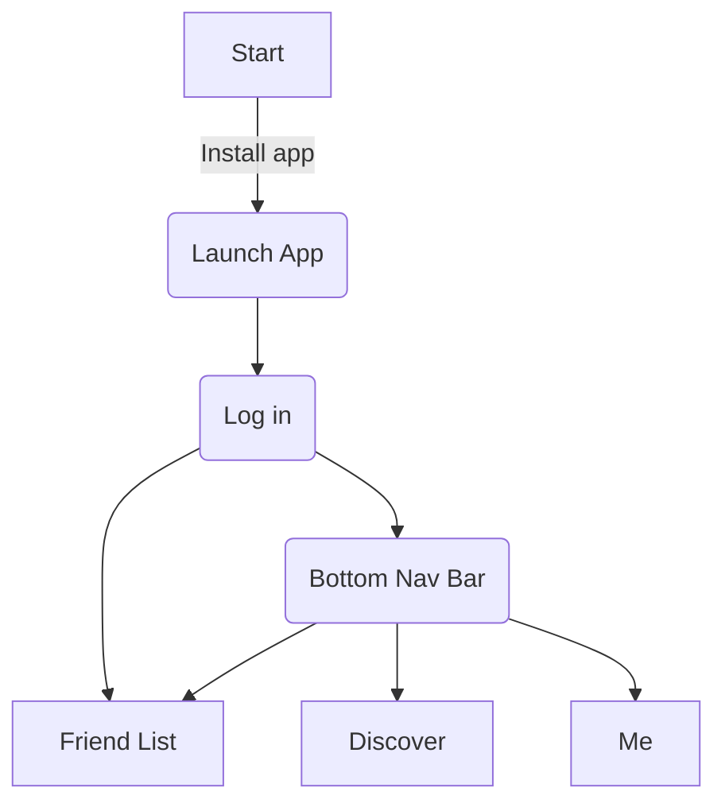
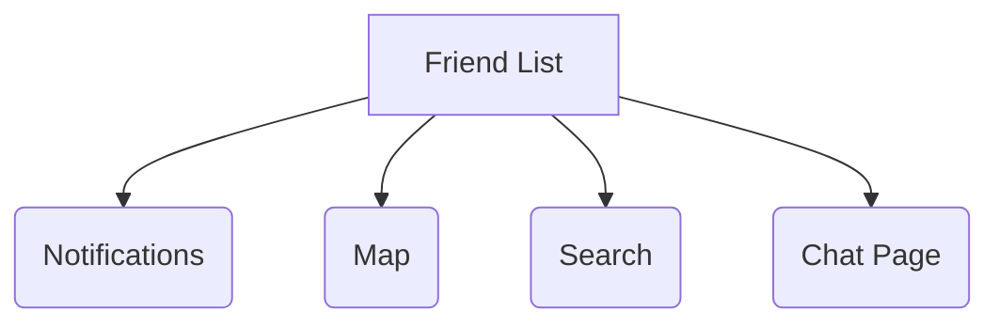
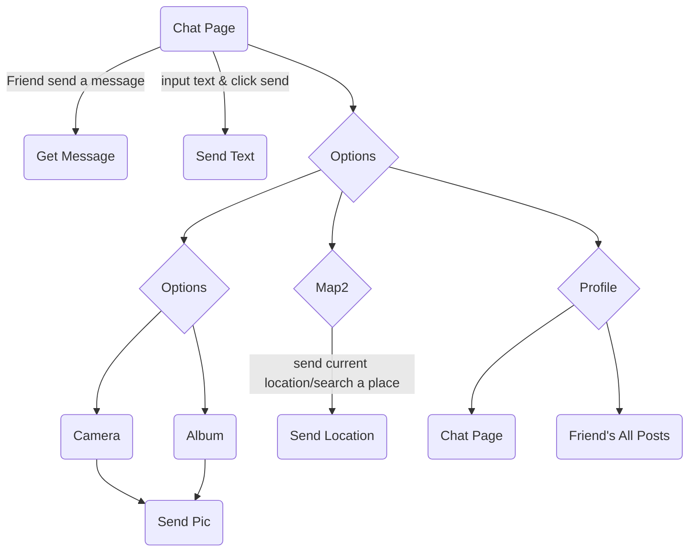
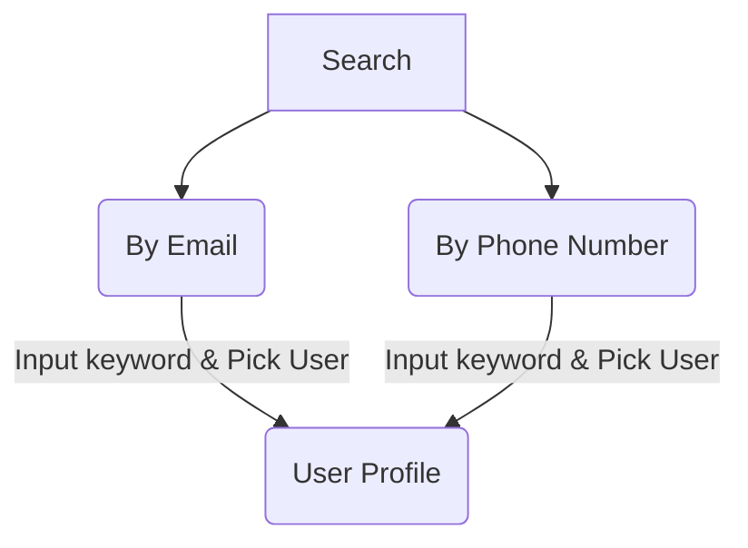
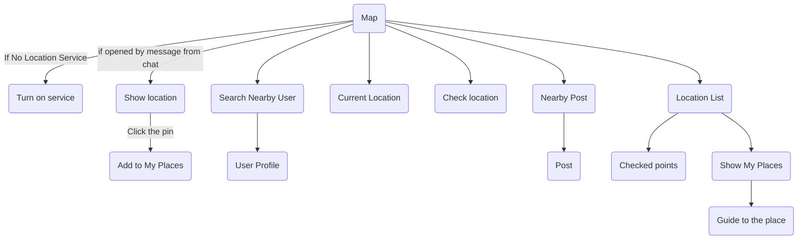
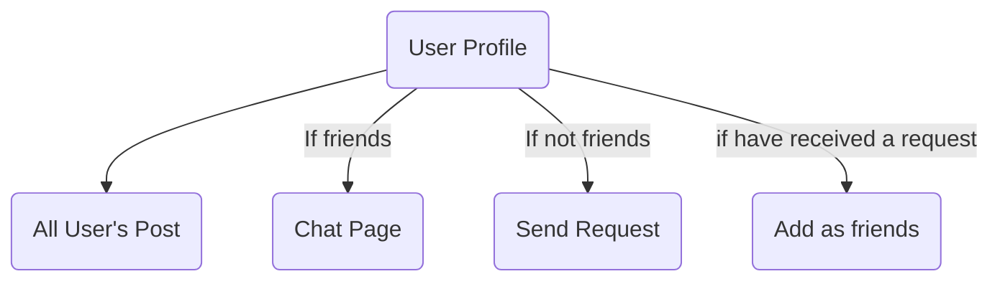
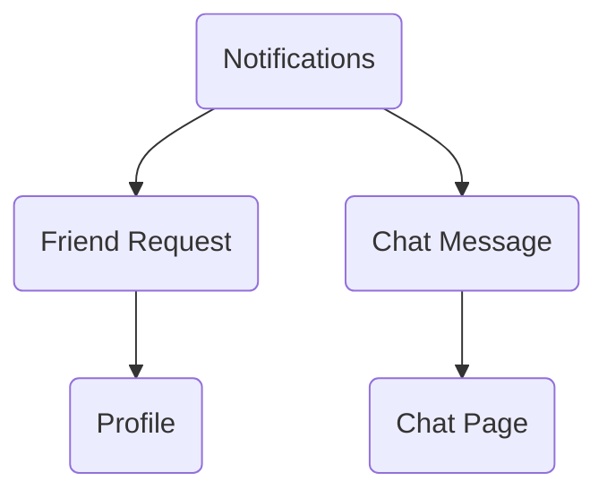
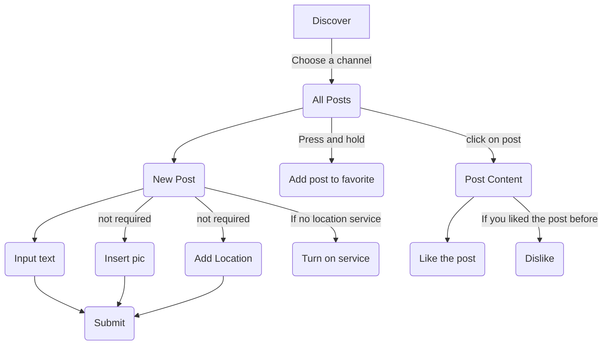
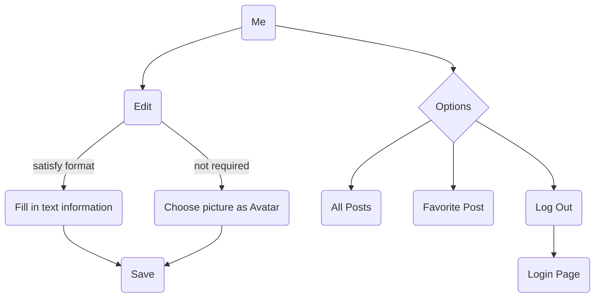

# Navigation Structure of Suplink

> This document will describe the structure of the app.

- <a href="#navOver" style="text-decoration:none">Overview</a>
- <a href="#navFrd" style="text-decoration:none">Friendlist</a>
- <a href="#navDis" style="text-decoration:none">Discover</a>
- <a href="#navMe" style="text-decoration:none">Me</a>

## Overview

## Friendlist

## Discover

## Me

    <a href="#navOver" style="text-decoration:none"><button>Back to top</button></a>

